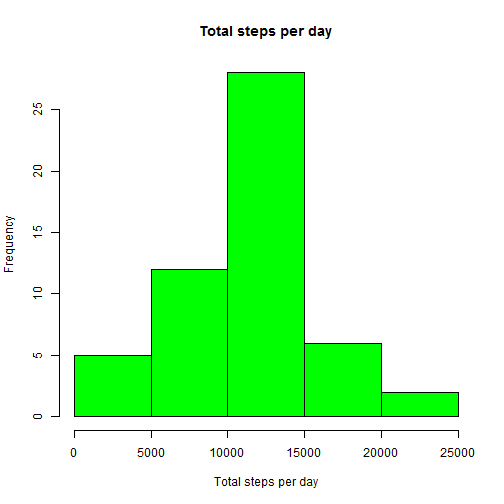
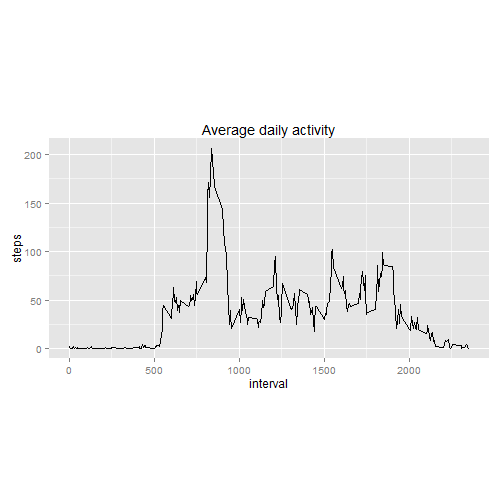

# Reproducible Research: Peer Assessment 1


## Loading and preprocessing the data


```r
data <- read.csv("activity.csv", header = TRUE)
wdays <- strptime(data$date, format = "%Y-%m-%d")
```

## What is mean total number of steps taken per day?


```r
library(reshape2)
dateNsteps <- data[, 1:2]
data_melt <- melt(dateNsteps, id = "date")
stepsPerDay <- dcast(data_melt, date ~ variable, sum)
nas <- is.na(stepsPerDay$steps)
totalStepsPerDay <- stepsPerDay$steps[!nas]
hist(totalStepsPerDay, main = "Total steps per day", xlab = "Total steps per day", 
    col = "green")
```

 

```r
mean(stepsPerDay$steps, na.rm = TRUE)
```

```
## [1] 10766
```

```r
median(stepsPerDay$steps, na.rm = TRUE)
```

```
## [1] 10765
```


## What is the average daily activity pattern?

```r

tempdata <- data.frame(data$steps, data$interval)
names(tempdata) <- c("steps", "interval")
data_melt <- melt(tempdata, id = "interval")
AvarageDailyActivity <- dcast(data_melt, interval ~ variable, mean, na.rm = TRUE)
with(AvarageDailyActivity, plot(interval, steps, main = "Average daily activity pattern", 
    type = "l", xlab = "interval", ylab = "Average steps"))
```

 


## Imputing missing values


## Are there differences in activity patterns between weekdays and weekends?
